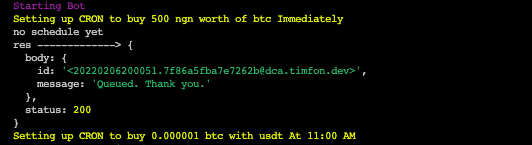

# Quidax DCA bot

This bot automatically buys crypto on your behalf on [Quidax](https://quidax.com) using their API while you sit back, relax and enjoy a cold one.




## What you need
- A Quidax account and your API secret key, get your secret key from **Account Settings > Developer Settings**.
- A Mailgun account ready with your domain & it's secret - *optional* 
## Features

- Scheduling
- Email notifications
- Out of the box support for Heroku deployment


## Usage/Examples

To use this bot, here are the steps you need to take:

- Clone the repo to your machine
    ```bash
    git clone https://github.com/Edmund1645/quidax-dca-bot && cd quidax-dca-bot
    ```
- Install the dependencies using yarn (sorry NPM lovers 🥲 )
    ```bash
    yarn
    ```
- Duplicate the `config.example.ts` and rename the duplicate to `config.ts`. 

    ```bash
    cp config.example.ts config.ts
    ```
    Use [crontab.guru](https://crontab.guru/) to visualize your `order` schedule.
- Deploy to your preferred cloud provider. YGMI 🎉


## Configuration options
| Property             | Description                                                                                                      | Required                                                   |
|----------------------|------------------------------------------------------------------------------------------------------------------|------------------------------------------------------------|
| `quidax_secret`      | Your Quidax API secret, you can find it under **Developer Settings**                                             | YES                                                        |
| `mailgun_secret`     | Your Mailgun API key, you can find it in your **Domain's settings**                                              | NO. if omitted, the bot will not send email notifications. |
| `mailgun_domain`     | The domain you want emails to be sent from.                                                                      | NO.                                                        |
| `notifications.from` | Sender's address for the notification email. ex, `bot@YOUR_MAILGUN_DOMAIN`                                       | Yes, if using Mailgun.                                     |
| `notifications.to`   | Your email address.                                                                                              | Yes, if using Mailgun                                      |
| `orders`             | An array containing the assests you want, and their schedules.  See the order object table for more information. | Yes                                                        |
|                      |                                                                                                                  |                                                            |

### Order object
| Property               | Description                                                                                                                                                                                                                                                                          | Required                                         |
|------------------------|--------------------------------------------------------------------------------------------------------------------------------------------------------------------------------------------------------------------------------------------------------------------------------------|--------------------------------------------------|
| `asset`                | What crypto you would like to buy. Allowed values:`btc`, `ltc`, `eth`, `xrp`, `usdt`, `dash`.                                                                                                                                                                                        | Yes                                              |
| `currency`             | What you want to make the purchase with. Allowed values: `ngn`, `ghs`, `usdt`.                                                                                                                                                                                                       | Yes                                              |
| `amount` or `quantity` | Use `amount` to buy the value worth of the specified currency (1,0000 ngn worth of eth), or use `quantity` to buy a fixed number of the asset, regardless of the price (100 xrp). **Note**: Quidax does have a minimum and maximum threshold for orders.                             | Yes. but only one should be speicified per order |
| `schedule`             | A cron string that specifies the interval at which the orders should be placed. If not specified, the order will be placed once & for-all. Use [Crontab.guru](https://crontab.guru) for setting a schedule.  **Note**: You have to factor in the timezone your server is running in. | NO, but it is recommended                        |

## Environment variables
This app uses environment variables, duplicate and rename the `.env.example` to `.env` and set the values. You may also need to set these variables on your cloud provider, depending on how you choose to deploy. the most important variable is the `QUIDAX_API_SECRET`